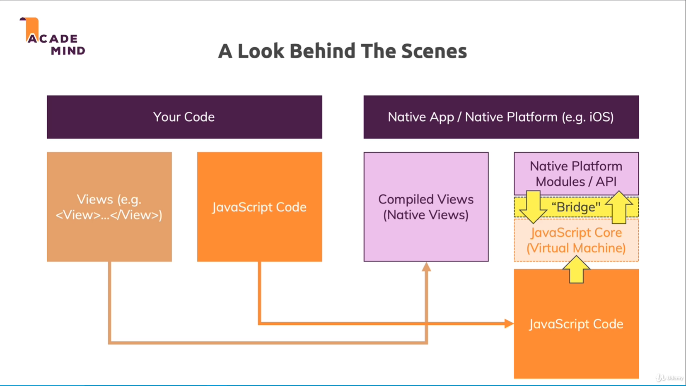

# ReactNative

[React Native allows developers who know React to create native apps.](https://reactnative.dev/docs/environment-setup)

React Native 是 Facebook 开发的一个开源的跨平台移动应用框架。它主要的特点包括:

- 跨平台:使用 React Native 可以只开发一套代码,然后生成 iOS 和 Android 原生应用。
- 声明式 UI:类似 React 在 Web 上的用法,使用声明式的方式来构建应用界面。
- 组件化:提供了一系列可复用的组件,开发者可以通过组合这些组件来构建应用。
- 热重载:支持热重载,可以在不重启应用的情况下加载 JS 代码的修改。
- 原生控制:内置很多原生控件,也可以通过 Bridge 机制调用平台原生能力。
- 灵活与高效:使用 JavaScript 开发可以获得很高的开发效率。底层使用异步机制,性能也很不错。
  React Native 的工作原理是在平台原生 UI 组件和 JavaScript 代码之间建立了一个 Bridge。JavaScript 代码可以调用 Bridge 提供的接口来控制原生组件的布局、样式等,原生组件也可以通过 Bridge 向 JavaScript 发送事件通知。
  

# RN 组件

[components-and-apis](https://reactnative.dev/docs/components-and-apis)

## 核心组件

React Native 提供了一系列核心组件,用于构建应用界面，他们不需要任何额外的软件包，核心组件的一个重要特点是，他们可以转化为平台原生组件。

- View: 类似于 div,用于布局。

- Text: 用于显示文本。

- Image: 用于显示图片。

- ScrollView: 用于滚动视图。

- TextInput: 用于输入文本。

- StyleSheet: 用于创建样式表。

- FlatList: 用于显示列表数据。

- SectionList: 用于显示分组列表数据。

- ActivityIndicator: 用于显示加载指示器。

- Button: 用于显示按钮。

- Modal: 用于显示模态对话框。

- Picker: 用于显示选择器。

- Slider: 用于显示滑块。

- Switch: 用于显示开关。

- RefreshControl: 用于下拉刷新。

- StatusBar: 用于控制状态栏。

- WebView: 用于显示 Web 页面。

## 社区组件

- React Navigation: 用于导航。

- React Nttive Screens: 用于优化屏幕性能。

- React Native Maps: 用于显示地图。

### react-native-video

[react-native-video is a React Native library that provides a Video component that renders media content such as videos and streams](https://thewidlarzgroup.github.io/react-native-video#about)

### react-native-splash-screen

react-native-splash-screen 是一个用于实现启动屏的库，它可以在应用启动时显示一个自定义的启动屏，然后在应用加载完成后自动隐藏。

#### 安装

```shell
yarn add react-native-splash-screen -S
```

#### 配置

##### Android

1.  在 Android 项目中，打开 MainActivity.kt 文件，导入头文件并添加启动屏代码。

```kotlin
package com.firstrn

import com.facebook.react.ReactActivity
import com.facebook.react.ReactActivityDelegate
import com.facebook.react.defaults.DefaultNewArchitectureEntryPoint.fabricEnabled
import com.facebook.react.defaults.DefaultReactActivityDelegate
import android.os.Bundle;
import org.devio.rn.splashscreen.SplashScreen;

class MainActivity : ReactActivity() {

  /**
   * Returns the name of the main component registered from JavaScript. This is used to schedule
   * rendering of the component.
   */
  override fun getMainComponentName(): String = "FirstRN"

  /**
   * Returns the instance of the [ReactActivityDelegate]. We use [DefaultReactActivityDelegate]
   * which allows you to enable New Architecture with a single boolean flags [fabricEnabled]
   */
  override fun createReactActivityDelegate(): ReactActivityDelegate {
    SplashScreen.show(this) // here
    return  DefaultReactActivityDelegate(this, mainComponentName, fabricEnabled)
  }

  override fun onCreate(savedInstanceState: Bundle?) {
    super.onCreate(null)
  }
}
```

2. 创建一个名为 launch_screen.xml 的布局文件，用于定义启动屏的样式。

```xml
<?xml version="1.0" encoding="utf-8"?>
<LinearLayout xmlns:android="http://schemas.android.com/apk/res/android"
    android:layout_width="match_parent"
    android:layout_height="match_parent">

    <ImageView
        android:layout_width="match_parent"
        android:layout_height="match_parent"
        android:background="@color/primary_light"
        android:src="@drawable/z" />

</LinearLayout>
```

#### 如何在 React Native 中使用

只需要在 App 组件中调用 SplashScreen.hide() 方法即可在应用加载完成后隐藏启动屏。

```javascript
import { FC } from "react";
import { NavigationContainer } from "@react-navigation/native";
import { createNativeStackNavigator } from "@react-navigation/native-stack";
import HomeSCreen from "./src/screen/HomeScreen";
import DetailsScreen from "./src/screen/DetailsScreen";
import SplashScreen from "react-native-splash-screen"; // 导入启动屏库

interface Props {}

const Stack = createNativeStackNavigator();

const App: FC<Props> = () => {
  SplashScreen.hide(); // 隐藏启动屏
  return (
    <NavigationContainer>
      <Stack.Navigator initialRouteName="Home">
        <Stack.Screen name="Home" component={HomeSCreen} options={{ title: "Home" }} />
        <Stack.Screen name="Details" component={DetailsScreen} options={{ title: "Details Title" }} />
      </Stack.Navigator>
    </NavigationContainer>
  );
};

export default App;
```

## 自定义原生组件

你可以使用平台原生语言编写原生组件，然后通过 Bridge 机制将原生组件暴露给 JavaScript 代码。
